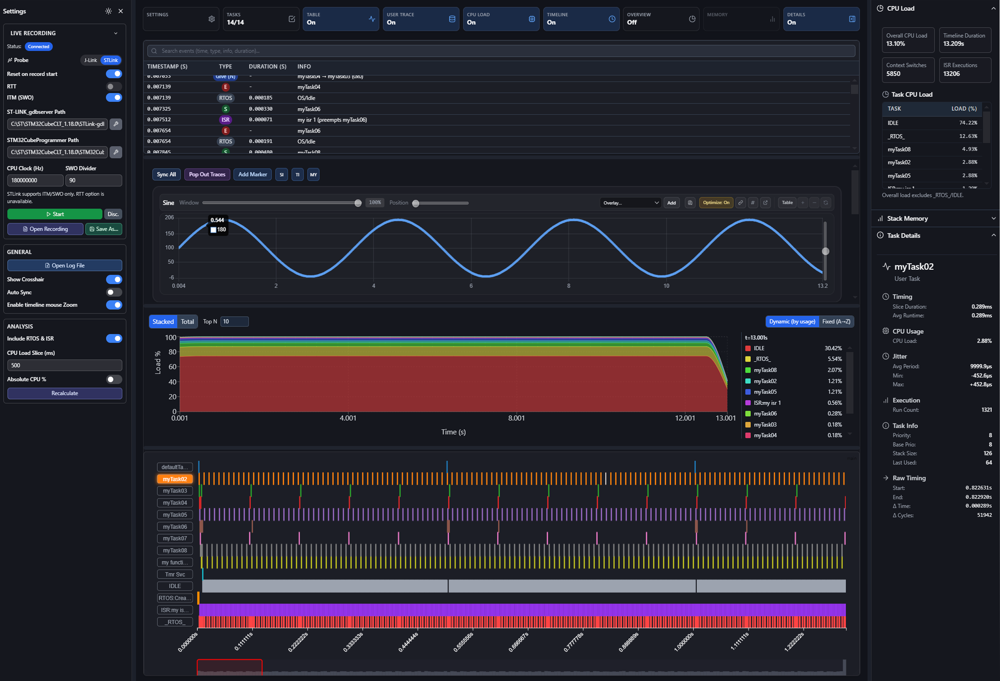

  
  

# ViewAlyzer Recorder Firmware

**Open-source recorder firmware for ViewAlyzer profiling and timeline analysis**

   

---

## Overview

This repository contains the **ViewAlyzer Recorder Firmware** - the open-source firmware components that integrate with your embedded projects to enable profiling and timeline analysis with ViewAlyzer.

## About ViewAlyzer

ViewAlyzer is a comprehensive profiler and timeline viewer for embedded systems development that provides:

**Live Recording** - Stream traces over STLink ITM/SWO, J-Link RTT, more transports coming soon.
**Timeline Visualization** - See tasks, ISRs, and preemptions with microsecond precision  
**CPU & Stack Analytics** - Track utilization, bottlenecks, and memory usage  
**Symbol-Level Insights** - Explore functions, memory maps, and call graphs  
**Offline Analysis** - Import and analyze pre recorded log files

**Platform Support:** Windows, Linux (Mac coming soon)

## Repository Contents

This repository includes:
- Recorder firmware 
- Example projects
- Community discussions and support

### Reporting Issues
- **Bug Reports**: Use our [bug report template](../../issues/new?assignees=&labels=bug&projects=&template=bug_report.md)
- **Feature Requests**: Use our [feature request template](../../issues/new?assignees=&labels=enhancement&projects=&template=feature_request.md)
- Please search existing issues before creating new ones

### Pull Requests
- Fork the repository and create a feature branch
- Use our [PR template](../../compare) when submitting
- All PRs will be reviewed by maintainers

### Discussion Categories

**[Announcements](../../discussions/categories/announcements)**  
Updates from maintainers

**[Feature Requests](../../discussions/categories/feature-request)**  
Share ideas for new features (also submit to [viewalyzer.net/feedback.html](https://viewalyzer.net/feedback.html) for voting)

**[General](../../discussions/categories/general)**  
Chat about anything and everything here

**[Q&A](../../discussions/categories/q-a)**  
Ask the community for help

**[Show and Tell](../../discussions/categories/show-and-tell)**  
Share how ViewAlyzer has helped in your projects

### Resources
- **Website:** [viewalyzer.net](https://viewalyzer.net)
- **Documentation:** [viewalyzer.net/docs.html](https://viewalyzer.net/docs.html)
- **Feature Board:** [viewalyzer.net/feedback.html](https://viewalyzer.net/feedback.html)
- **FAQ:** [viewalyzer.net/faq.html](https://viewalyzer.net/faq.html)

### Contact
- **Issues & Bugs:** Use GitHub [issues](../../issues)
- **Feature Requests:** Use GitHub [issues](../../issues) or [discussions](../../discussions)
- **General Support:** [discussions](../../discussions) or support@viewalyzer.net

## Licensing

**Recorder Firmware:** Open source (see LICENSE file)  
**ViewAlyzer Application:** Commercial software

[View Pricing](https://viewalyzer.net/#pricing)

## Acknowledgments

Thank you to our community for contributing code, reporting issues, suggesting features, and supporting the embedded systems ecosystem.

---

**Ready to make your firmware visible?**

[Download ViewAlyzer](https://viewalyzer.net/#pricing) | [Documentation](https://viewalyzer.net/docs.html) | [Start Contributing](../../issues)

© 2025 ViewAlyzer. All rights reserved. ViewAlyzer is a product of Free Radical Labs.

